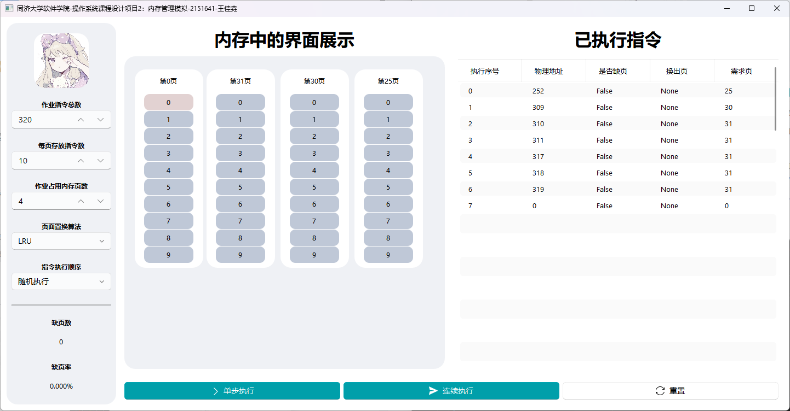

# 项目简介

本项目为同济大学软件学院2023年春季学期操作系统课程项目的请求调页存储管理方式模拟项目。通过模拟内存中指令的执行以及缺页置换的过程，本项目通过可视化很好的展现了内存管理的核心思路。

# 项目功能



- 实现了请求调页存储管理方式模拟的基本功能
- 指令的单步执行和连续执行，以及模拟运行的重置
- 指令总数、每页存放指令数、作业占内存页数可在可定范围内更改
- 可以更换页面置换算法，有FIFO和LRU
- 可以选择指令执行顺序，有随机执行和预设执行，其中预设执行推荐以默认参数执行，会演示17条预设指令，包括了LRU算法中的各种情况的展示
- 生动形象的内存中的界面展示，还附带动画
- 已执行指令的相关信息以列表展示，展示模拟运行的日志

# 运行代码

在项目根目录:

```
pip install -r requirements. txt
```

在[zhiyiYo/PyQt-Fluent-Widgets at PyQt6 (github.com)](https://github.com/zhiyiYo/PyQt-Fluent-Widgets/tree/PyQt6)安装PyQt6-Fluent-Widgets包的pyqt6版本==0.9.1

然后运行:

```
python start.py
```

# 其他

- 提示清晰，引导好


- 动画效果好，不管是交换栈里页面的顺序还是新加页面都很生动，展示清晰


- 交互性好


# 项目总结

## 项目亮点

- 模拟运行参数可自定义，实现了两种算法
- 页面美观，动画流畅
- 演示生动形象，加上有日志显示，便于观察
- 提示信息清晰
- 代码架构较好

## 项目改进方向

- 可以考虑更多的置换算法
- 暂无撤回上一步操作的功能，可以做一个状态机
- 可以实现模拟演示更多地自定义功能
- 可以导入指定指令文件执行
- 代码结构可以进一步优化（写到后面就再也没在意代码结构了×）